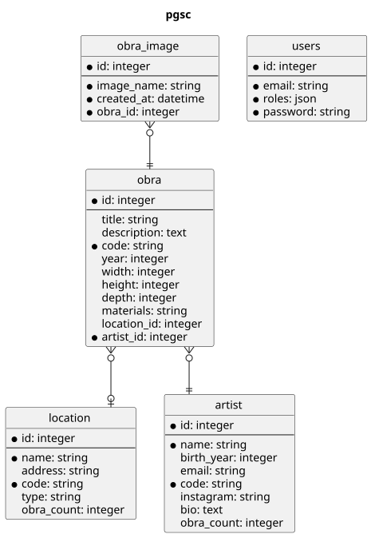

# Popup Galleries of San Cris

This is the admin side of the popup galleries project.

<a href="https://asciinema.org/a/bJMOlPe5F4mFLY0Rl6fiJSOp3" target="_blank"></a>


Requirements
------------

* PHP 8.4
* postgres and PDO-SQLite PHP extension enabled;
* and the [usual Symfony application requirements][2].

## Notes

This was removed during development, but maybe someday will be re-added.

```bash
composer req agence-adeliom/easy-media-bundle
```


Installation
------------

```bash
git clone git@github.com:survos-sites/pgsc && cd pgsc
composer install
bin/console doctrine:schema:update --force
bin/console doctrine:fixtures:load -n
symfony server:start -d
symfony open:local --path=/en/artist/edit/1
```

Admin from fixtures:

    'email' => 'admin@example.com',
    'plainPassword' => 'adminpass',

# For maps

```bash
bin/console workflow:iterate App\\Entity\\Location --marking=new --transition=geocode
```

## Loading real tour data (Artists / Locations / Obras)

`doctrine:fixtures:load` (above) seeds dummy/dev data. Real content comes from CSV exports in
`data/` via `app:load`:

```bash
bin/console app:load                # imports data/artistas.csv + artists.csv, locations.csv, and obras
bin/console app:load --reset        # same, but purges Artist/Location/Obra first
```

**Known gotcha:** `app:load` currently reads Obras from `data/omar_exhibition.csv` (legacy
filename), but the CSV actually checked into `data/` is `piezas.csv` — same columns
(`code,artist_code,loc_code,photoUrl,...,title,material,size,year,description,price`), just a
different name. Until `LoadCommand.php` is updated to read `piezas.csv` directly, copy it first:

```bash
cp data/piezas.csv data/omar_exhibition.csv
bin/console app:load
```

Rows with a blank `artist_code` will currently fail the import (not-null constraint on
`obra.artist_code`) — skip or fix those rows in the CSV if you hit this.

Production (`chijal.org`) is kept in sync from Kryzia's Google Spreadsheet — see
`config/packages/survos_google_sheets.yaml` — not from these CSVs directly; the CSVs are a
point-in-time export usable for local dev. This whole pipeline (spreadsheet -> DB) is a known
rough edge, kept only because it was the safe path during a database migration; a real admin UI
is the intended replacement (see Project Goals below), not the spreadsheet sync.

## Tour data endpoint (for the `sos` tour viewer)

`GET /tourforge.json` aggregates every geocoded Location (with its Obras folded in as
gallery/narration/description) into [TourForge](https://github.com/tourforge)'s `tourforge.json`
shape — this is what `sos`'s `bin/console tourforge:fetch chijal` consumes, the same way it
already consumes the Florence Navigator / FMU Campus Tour sources. `GET /tourforge/asset/{hash}`
serves/redirects to the actual image or audio file for an asset hash referenced in that JSON.

One Location = one tour "stop" (a physical place with lat/lng); Locations without both `lat` and
`lng` set are skipped, since TourForge stops require coordinates. See `sos`'s
`docs/tourforge-integration.md` for the full schema and the rest of the pipeline.


## Database




## Project Goals

To administer the Popup Galleries of San Cris exposition, and provide the data for the associated mobile app.

As an administrator, I can

* Add/Edit Locations
* Add/Edit Artists
* Add/Edit Artwork
* Manage Users
* Print reports 
  * Artwork by Artist 
  * Artwork by Location
  * Catalog
* Trigger requests for automatic translations of the database

As an artist, I can

* Add/Edit my artwork, including pricing, description, etc.
* Update my profile (bio, photo, etc.)
* Give admin permissions to another user for my artwork

As a registered user, from the website, I can

* "Like" or clap for pieces I like
* See links to purchase
* Share items on Social media

As a Visitor, I can

* See the artist and locations
* See artwork with QR codes
* Link to the mobile app


The mobile app requirements are listed elsewhere, this is for the desktop-based website.
.

# Developer notes

```bash
composer config repositories.ezmeadia '{"type": "vcs", "url": "git@github.com:tacman/easy-media-bundle.git"}'
composer req tacman/easy-media-bundle:dev-tac
```
