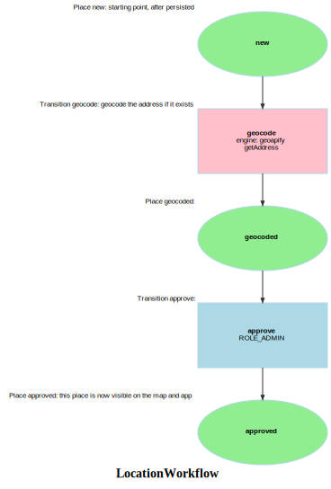

Markdown for LocationWorkflow




---
## Transition: geocode

### geocode.Transition

onGeocode()
        // 
        // geocode the address if it exists

```php
#[AsTransitionListener(self::WORKFLOW_NAME, self::TRANSITION_GEOCODE)]
public function onGeocode(TransitionEvent $event): void
{
    $location = $this->getLocation($event);
    if ($location->getAddress()) {
        $geo = $this->geoapifyService->lookup($location->getAddress())['features'][0]['properties'];
        if (!array_key_exists('lat', $geo)) {
            dd($geo);
        }
        $location->setLat($geo['lat'])
            ->setLng($geo['lon']);
    } else {
        assert(false, "why didnt guard catch this? ");
    }
}
```
[View source](pgsc/blob/main/src/Workflow/LocationWorkflow.php#L32-L45)


