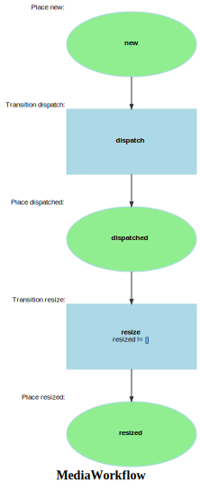

Markdown for MediaWorkflow




---
## Transition: dispatch

### dispatch.Transition

onDispatch()
        // 
        // 

```php
#[AsTransitionListener(self::WORKFLOW_NAME, self::TRANSITION_DISPATCH)]
public function onDispatch(TransitionEvent $event): void
{
    $media = $this->getMedia($event);
    $code = $media->code;

    if ($media->type === 'audio') {
        $resp = $this->sais->dispatchProcess(new ProcessPayload(
            LoadCommand::SAIS_ROOT,
            [$media->getOriginalUrl()],
            mediaCallbackUrl: $this->urlGenerator->generate(
                'sais_audio_callback',
                ['code' => $code, '_locale' => 'es'],
                UrlGeneratorInterface::ABSOLUTE_URL
            )
        ));
        dd($resp);
    } else {
        $resp = $this->sais->dispatchProcess(new ProcessPayload(
            LoadCommand::SAIS_ROOT,
            [$media->getOriginalUrl()],

            mediaCallbackUrl: $this->urlGenerator->generate(
                'app_media_webhook',
                ['code' => $code, '_locale' => 'en'],
                UrlGeneratorInterface::ABSOLUTE_URL
            ),
            thumbCallbackUrl: $this->urlGenerator->generate(
                'app_thumb_webhook',
                ['code' => $code, '_locale' => 'en'],
                UrlGeneratorInterface::ABSOLUTE_URL
            )
        ));
    }

    // Also store immediate response URLs if available
    if ($resized = $resp[0]['resized'] ?? null) {
        $media->resized = $resized;
    }
}
```
[View source](pgsc/blob/main/src/Workflow/MediaWorkflow.php#L43-L81)

### dispatch.Completed

OnDispatchCompleted()
        // 
        // 

```php
#[AsCompletedListener(self::WORKFLOW_NAME, self::TRANSITION_DISPATCH)]
public function OnDispatchCompleted(CompletedEvent $event): void
{
    $media = $this->getMedia($event);
    if ($this->mediaWorkflow->can($media, IMediaWorkflow::TRANSITION_RESIZE)) {
        $this->mediaWorkflow->apply($media, IMediaWorkflow::TRANSITION_RESIZE);
    }

}
```
[View source](pgsc/blob/main/src/Workflow/MediaWorkflow.php#L84-L91)


---
## Transition: resize

### resize.Transition

onResize()
        // 
        // 

```php
#[AsTransitionListener(self::WORKFLOW_NAME, self::TRANSITION_RESIZE)]
public function onResize(TransitionEvent $event): void
{
    $media = $this->getMedia($event);
}
```
[View source](pgsc/blob/main/src/Workflow/MediaWorkflow.php#L95-L98)


