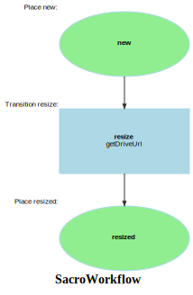

Markdown for SacroWorkflow




---
## Transition: resize

### resize.Transition

onTransition()
        // 
        // 

```php
#[AsTransitionListener(self::WORKFLOW_NAME, self::TRANSITION_RESIZE)]
public function onTransition(TransitionEvent $event): void
{
    $sacro = $this->getSacro($event);
    $result = $this->saisClientService->dispatchProcess(
        new ProcessPayload('sacro', [
            $sacro->getDriveUrl()
        ])
    );
    dd($result);
}
```
[View source](pgsc/blob/main/src/Workflow/SacroWorkflow.php#L30-L39)


